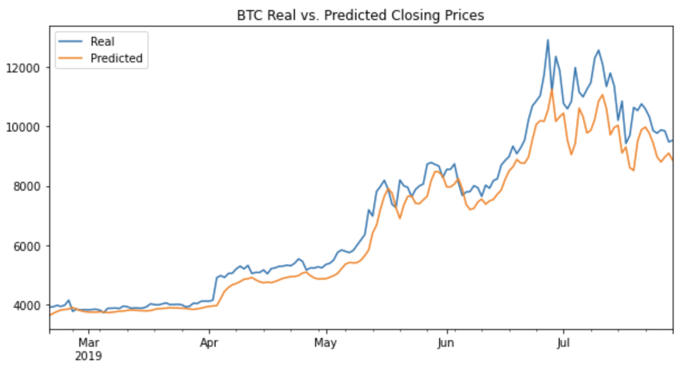
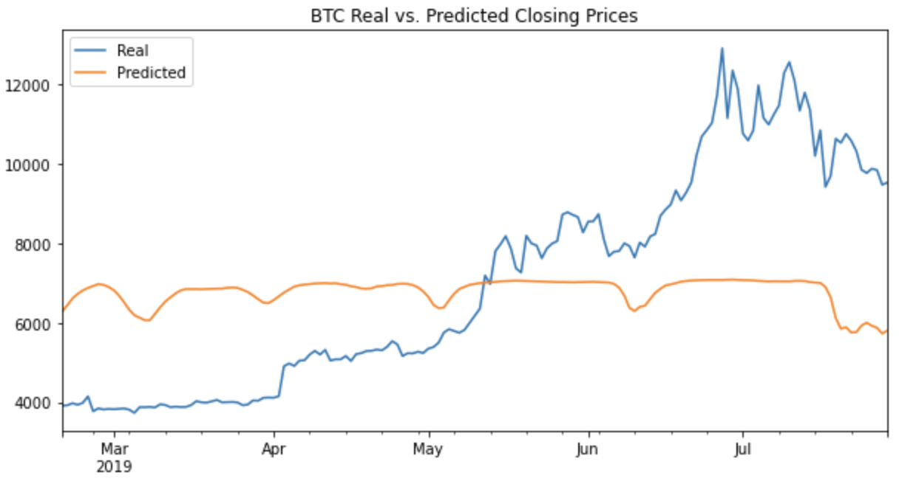

# LSTM Stock Predictor

The Crypto Fear and Greed Index (FNG) attempts to use a variety of data sources to produce a daily FNG value for cryptocurrency. The following notebooks build and evaluate deep learning models using both the FNG values and simple closing prices to determine if the FNG indicator provides a better signal for cryptocurrencies than the normal closing price data.  The code will use deep learning recurrent neural networks to model bitcoin closing prices. One model will use the FNG indicators to predict the closing price while the second model will use a window of closing prices to predict the nth closing price.

---

## Technologies

Language: Python3, Pandas 

Imports: numpy, pandas, hvplot.pandas, Path from pathlib, seed from numpy.random, random from tensorflow, MinMaxScaler from sklearn.preprocessing, Sequential from tensorflow.keras.models and LSTM, Dense, Dropout from tensorflow.keras.layers

External Resources: btc_sentiment.csv and btc_historic.csv

Developed with JupyterLab

---

## Installation

JupyterLab - [Install JupyterLab](https://jupyterlab.readthedocs.io/en/stable/getting_started/installation.html)

---

## Examples

LSTM stock predictor using closing prices results:

LSTM stock predictor using fear and greed index results:

---

## Contributors

Drew Disbrow Marnell: dldmarnell@gmail.com

---

## License

MIT License
Copyright (c) 2021 Drew Disbrow Marnell